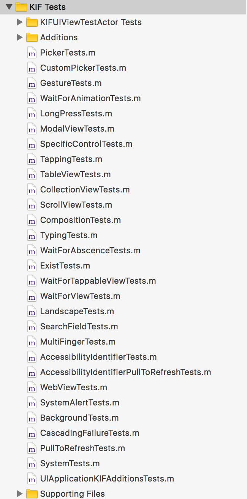
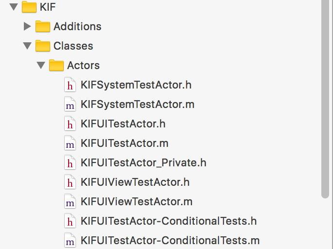

### 前言

为了保证我们的应用可靠，我们平时通常要不断地点击应用来测试，以及时发现更多的问题，但这个过程是非常耗时的，不管是编译时间还是操作时间。因此，自动的UI测试就很有必要。前面提到的XCode在iOS7中已经集成了UI测试，并且结合**UI Record**这个功能，加上**MacOS Server**也能完成很多功能。不过KIF这个框架也能帮助我们去模拟用户输入来测试，而且KIF有XCode UITest所做不了的功能，这一点后面会提到。

KIF是2011年推出的一款开源的，界面／集成测试框架，帮助开发者完成自动化测试等功能，在Xcode UI Test推出之前，它是iOS上比较热门的集成测试工具（虽然现在也比较热门）。其功能丰富，支持版本、语言多，又支持持续集成，非常有利于我们的开发测试，国内的美团使用该框架。

### XCode UI Test 与 KIF 的区别

Apple在Xcode7推出了UI Test，并且集成于XCTest中。UI Test的前身是UIAutomation，不过官方关于UIAutomation的文档很少，而且要用javascript写测试脚本，然后放到Instructment中运行，这样子非常的不方便。2011年KIF推出，并可以很好地与XCTest适配，不过问题在于，我们不知道什么时候他会停止维护，一旦Apple修改了系统接口，那么我们的测试就会有问题。所以如果能用官方的测试框架当然还是选择官方的测试框架，只不过它们相比较也各有好坏，应该依据实际情况来做测试。

下面是它们各自的优势：

#### XCode UI Test 优势

* **官方充分支持：**任何时候，对于一个官方支持的框架，你都不用担心后面会有什么适配问题，或者停止维护而导致所有测试都要重来。而KIF则不同，也许是五年后、也许是明年、也许是下个月，由于各种原因，框架都会停止维护，又或者说，什么时候Apple修改了相关系统接口，那就会有问题了。

* **支持Swift（这一点相对于UIAutomation来说）：**UIAutomation很老，在Swift之前很久就存在，因此他自然不支持swift，新推出的UITest同时支持OC和swift，当然，KIF也支持。

* **集成于Xcode：**XCode UITest集成于XCodeIDE中，任何时候我们想使用，可以直接使用，而不用额外安装；不过KIF发展到今天也不会很难集成。

* **继承自XCTestCase：**这意味着我们可以直接使用XCTestCase基类的接口；UITets推出后，KIFTestCase也继承自XCTestCase了，所以差别不会很大。

* **UI Recording：**这一点应该是XCode UITest最大的优势了，直接点击应用就可以生成相关的UI获取代码。虽然现在还存在一些问题，比如断言避免不了需要手写，需要考虑测试代码分块等，但依然不失为一个很好的功能。

#### KIF 优势

* **测试时直接获取到UIView：**KIF在测试过程中，是直接获取到应用程序，可以直接取得UIView等控件，因此各种属性可以直接判断；但是XCTest就显得很不方便，它并没有直接取得应用程序，而是在现有的视图上取得XCUIElement，该类和UIView有很大差别，基本上UIView的属性我们无法判断。

* **系统支持版本多：**KIF推荐的系统版本是iOS 8.1或更高，不过低版本依然能用；而XCTest则没有那么好的支持了，只能支持iOS 9.0以后，眼下这是一个很大的问题。

* **速度相对快一些：**XCTest原则上每个UI测试都要重新启动一遍应用，这样的耗时是惊人的，而KIF则不用。

* **文档、教程比较多：**KIF从2011年推出至今，网上已有大量的教程和问答，可能很方便找到解决方案，而XCode UI Test则不同，推出不久，相关资料还不是很多。

### KIF的使用

**KIF的安装有两种途径，Cocoapods以及从GitHub下载库文件**，由于后一种方法比较复杂，读者自行异步[GitHub](https://github.com/kif-framework/KIF)查看。

通过Cocoapods安装我们只需和以往一样在podfile文件中添加相关名称即可，不过需要注意的是，添加之前要确保**App Test Target**已经创建（如何创建参照第二篇文章：XCTest的使用），添加相关信息到podfile之后，就`pod install`：

		target 'Your Apps' do
		  ...
		end
		
		target 'Acceptance Tests' do
		  pod 'KIF', :configurations => ['Debug']
		end
		
		
		$ pod install
		
由于KIF获取控件是基于**accessibility label**，有时候需要使用到**accessibility identifier**，所以我们可以安装KIF-Identifier-Test的pod辅助库（作用后面会介绍）：

		pod 'KIF/IdentifierTests'
		
一切都安装完之后，我们要在应用程序中运行托管测试。如果是新建的Test Bundle，Xcode会默认帮我们配置，如果我们是迁移旧Bundle，那么需要手动配置一下：

* Build Phases -> Target Dependencies -> 添加MyApplication
* Build Settings -> Linking -> Bundle Loader 填入 `$(TEST_HOST)`；Testing -> Test Host -> $(BUILT_PRODUCTS_DIR)/MyApplication.app/MyApplication; 保证 Wrapper Extension 设置为 xctest	
* Edit Scheme -> Test -> + test target

**KIF测试用例编写必须为Unit Test，而不是UI Test**，KIF的功能就是让我们在Unit Test中测试UI。
**因此，KIF的测试用例可以嵌在原生的test方法里面，也可以如Specta、Kiwi等BDD模式中使用**：

**KIF使用的测试类继承KIFTestCase，KIFTestCase继承子XCTestCase，所以我们可以和往常一样使用XCTestCase的方法**

**Test Method中的KIF用例：**

		#import <KIF/KIF.h>
		
		@interface LoginTests : KIFTestCase
		@end
		
		#import "LoginTests.h"
		#import "KIFUITestActor+EXAdditions.h"
		
		@implementation LoginTests
		
		- (void)beforeEach
		{
		    [tester navigateToLoginPage];
		}
		
		- (void)afterEach
		{
		    [tester returnToLoggedOutHomeScreen];
		}
		
		- (void)testSuccessfulLogin
		{
		    [tester enterText:@"user@example.com" intoViewWithAccessibilityLabel:@"Login User Name"];
		    [tester enterText:@"thisismypassword" intoViewWithAccessibilityLabel:@"Login Password"];
		    [tester tapViewWithAccessibilityLabel:@"Log In"];
		
		    // Verify that the login succeeded
		    [tester waitForTappableViewWithAccessibilityLabel:@"Welcome"];
		}
		
		@end
		
**Specta中使用：**

		#import <Specta.h>
		#import <KIF.h>
		
		SpecBegin(App)
		
		describe(@"Tab controller", ^{
		
		  it(@"should show second view when I tap on the second tab", ^{
		    [tester tapViewWithAccessibilityLabel:@"Second" traits:UIAccessibilityTraitButton];
		    [tester waitForViewWithAccessibilityLabel:@"Second View"];
		  });
		
		});
		
		SpecEnd
		
如果我们使用的测试类不继承XCTestCase，那么需要实现以下代理：

* (void)failWithException:(NSException *)exception stopTest:(BOOL)stop;
* (void)failWithExceptions:(NSArray *)exceptions stopTest:(BOOL)stop;

在上面的例子中，我们可以看到，**有关UI控件的交互都会用到AccessibilityLabel**这个参数，关于**Accessibility**内容比较多，详情见[官方文档](https://developer.apple.com/library/content/documentation/UserExperience/Conceptual/iPhoneAccessibility/Introduction/Introduction.html#//apple_ref/doc/uid/TP40008785-CH1-SW1)，这里做个简单介绍。

Accessibility是苹果AppKit、UIKit提供给残疾人士使用的一套服务，比如视听障碍等。其为控件提供**label、frame、hint、traits、value**等几个属性，用于支持Accessibility功能。其中，**label**用于介绍控件，**frame**则是控件的位置大小，**hint**是一些响应类控件的触发描述，**trait**表示控件特征（ru：Button、Selected），**value**则是值变化控件当前值（如：UISlider）。其实在AppKit框架中，还有**accessibilityIdentifier**这个字段，只不过UIKit没有。以上这些字段都存储在**UIAccessibilityElement类**中，该类用于描述控件的Accessibiility。我们也可以看一下**UIAccessibilityElement**接口定义：

		NS_CLASS_AVAILABLE_IOS(3_0) @interface UIAccessibilityElement : NSObject<UIAccessibilityIdentification>
		
		// initialize with the accessibility container that contains this element
		- (instancetype)initWithAccessibilityContainer:(id)container;
		
		@property (nullable, nonatomic, assign) id accessibilityContainer;
		@property (nonatomic, assign) BOOL isAccessibilityElement;
		@property (nullable, nonatomic, strong) NSString *accessibilityLabel;
		@property (nullable, nonatomic, strong) NSString *accessibilityHint;
		@property (nullable, nonatomic, strong) NSString *accessibilityValue;
		@property (nonatomic, assign) CGRect accessibilityFrame;
		@property (nonatomic, assign) UIAccessibilityTraits accessibilityTraits;
		
		// When set, -[UIAccessibilityElement accessibilityFrame] will automatically adjust for the container's frame.
		// This can be useful when the element is a descendant of a scroll view, for instance.
		@property (nonatomic, assign) CGRect accessibilityFrameInContainerSpace NS_AVAILABLE_IOS(10_0);
		
		@end
		
有了该类，KIF再通过**UIApplication**的`accessibilityElementMatchingBlock`方法以及**UIAccessibilityElement**的`viewContainingAccessibilityElement`方法，来获取界面上相关的Accessibiility控件，以判断是否显示正确。

**以上就是KIF利用Accessibiility来做界面测试的基本原理**。

**需要注意的是，由于KIF基于Accessibility，因此我们在初始化控件时，不管是代码还是InterfaceBuilder，都要记得对需要测试的控件设置AccessibilityLabel和AccessibilityTrait。**

KIF作者并没有提供介绍文档，不过GitHub上的工程中有测试例子，如下图所示：

其中几乎涵盖了我们日常用到的所有控件的测试，在这些例子中我们能找到自己需要的测试方法。

这里以其中的`SearchFieldTests.m`和`TableViewTests.m`为例子，简要介绍一下：

**SearchFieldTests：**

		@implementation SearchFieldTests
		
		- (void)beforeEach
		{
			// 1.在测试用例开始之前，先点击首页的TableViews Cell
			// 从而进入子页面
		   [tester tapViewWithAccessibilityLabel:@"TableViews"];
		}
		
		- (void)afterEach
		{
			// 2.在测试完成之后，点击`Test Suite` 导航栏按钮退回首页
		   [tester tapViewWithAccessibilityLabel:@"Test Suite" traits:UIAccessibilityTraitButton];
		}
		
		// 3.测试搜索栏
		- (void)testWaitingForSearchFieldToBecomeFirstResponder
		{
			// 3.1 点击具有`UIAccessibilityTraitSearchField`事件的视图
		   [tester tapViewWithAccessibilityLabel:nil traits:UIAccessibilityTraitSearchField];
		   
		   // 3.2 等待具有`UIAccessibilityTraitSearchField`事件的视图变为FirstResponder
		   [tester waitForFirstResponderWithAccessibilityLabel:nil traits:UIAccessibilityTraitSearchField];
		   
		   // 3.3 在当前的FirstResponder输入文本test
		   [tester enterTextIntoCurrentFirstResponder:@"text"];
		   
		   // 3.4 等待具有`UIAccessibilityTraitSearchField`事件且具有值@"text"的视图出现
		   // 		其实就是等待输入成功
		   [tester waitForViewWithAccessibilityLabel:nil value:@"text" traits:UIAccessibilityTraitSearchField];
		}
		
		@end
		
以上就是**SearchFieldTests**的测试例子，其中我们可以看到`- (void)beforeEach`和`- (void)afterEach`两个重写，这两个方法也相当于基类`XCTestCase`的`setUp`和`tearDown`。
其中还有`tester`，这是一个类`KIFUITestActor`实例的宏，类似的还有`system`=`KIFSystemTestActor`，`viewTester`=`KIFUIViewTestActor`。
`KIFSystemTestActor`与`KIFUIViewTestActor`继承自`KIFUITestActor`，`KIFUITestActor`继承自`KIFTestActor`，它们是界面测试的核心，提供了大部分功能。

**TableViewTests：**

		@implementation TableViewTests
		
		- (void)beforeEach {
		    [tester tapViewWithAccessibilityLabel:@"TableViews"];
		}
		
		- (void)afterEach {
		    [tester tapViewWithAccessibilityLabel:@"Test Suite" traits:UIAccessibilityTraitButton];
		}
		
		- (void)testTappingRows {
			// 1.点击`AccessibilityIdentifier`为@"TableView Tests Table"的空间的某个indexPath
		   [tester tapRowAtIndexPath:[NSIndexPath indexPathForRow:1 inSection:2] inTableViewWithAccessibilityIdentifier:@"TableView Tests Table"];
		   // 2.等待`AccessibilityLabel`为@"Last Cell"且具有事件`UIAccessibilityTraitSelected`的视图的出现
		   [tester waitForViewWithAccessibilityLabel:@"Last Cell" traits:UIAccessibilityTraitSelected];
		   
		   // 3.与前面相似，点击第一行
		    [tester tapRowAtIndexPath:[NSIndexPath indexPathForRow:0 inSection:0] inTableViewWithAccessibilityIdentifier:@"TableView Tests Table"];
		    // 4.等待第一行Cell的响应
		    [tester waitForViewWithAccessibilityLabel:@"First Cell" traits:UIAccessibilityTraitSelected];
		}
		
		- (void)testMoveRowDown {
		    [tester tapViewWithAccessibilityLabel:@"Edit"];
		    
		    // 断言section:1 row:0的cell.textLabel.text为@"Cell 0"
		    __KIFAssertEqualObjects([tester waitForCellAtIndexPath:[NSIndexPath indexPathForRow:0 inSection:1] inTableViewWithAccessibilityIdentifier:@"TableView Tests Table"].textLabel.text, @"Cell 0", @"");
		    // 断言section:1 row:4的cell.textLabel.text为@"Cell 4"
		    __KIFAssertEqualObjects([tester waitForCellAtIndexPath:[NSIndexPath indexPathForRow:4 inSection:1] inTableViewWithAccessibilityIdentifier:@"TableView Tests Table"].textLabel.text, @"Cell 4", @"");
		    
		    // 移动section:1 row:0的cell到section:1 row:4
		    [tester moveRowAtIndexPath:[NSIndexPath indexPathForRow:0 inSection:1] toIndexPath:[NSIndexPath indexPathForRow:4 inSection:1] inTableViewWithAccessibilityIdentifier:@"TableView Tests Table"];
		    
		    // 断言section:1 row:0的cell.textLabel.text为@"Cell 1"
		    __KIFAssertEqualObjects([tester waitForCellAtIndexPath:[NSIndexPath indexPathForRow:0 inSection:1] inTableViewWithAccessibilityIdentifier:@"TableView Tests Table"].textLabel.text, @"Cell 1", @"");
		    // 断言section:1 row:4的cell.textLabel.text为@"Cell 0"
		    __KIFAssertEqualObjects([tester waitForCellAtIndexPath:[NSIndexPath indexPathForRow:4 inSection:1] inTableViewWithAccessibilityIdentifier:@"TableView Tests Table"].textLabel.text, @"Cell 0", @"");
		    
		    [tester tapViewWithAccessibilityLabel:@"Done"];
		}
		
		@end
		
上面例子中的`__KIFAssertEqualObjects`其实就是`XCTAssertEqualObjects`，对应的还有`__KIFAssertEqual`=`XCTAssertEqual`，详情见`KIFStepValidation.h`。

另外，更多交互方法详见**Actor**目录下的类，特别是`KIFUITestActor`，包含了大部分的方法：

### 总结

在这篇文章由于篇幅有限，加上本人对KIF没有非常多的实战经验，不敢班门弄斧，所以不准备继续深入介绍KIF；在以后我继续深入了解并多加实践，另有所启发之后，会在另外的文章中深入介绍KIF。本文就先抛砖引玉。

总的来说，KIF和XCode UI Test类似，用于界面测试／集成测试，但相比起XCTest，有灵活、文档多、功能丰富、支持版本多等优势，当然也有非官方提供等劣势。如果能和XCode UI Test配合着用，简单的功能测试用XCode UI Test，复杂的功能用KIF，才能发挥他们最大的作用。当然官方的工具永远都是放在第一位考虑，在以后XCode UI Test越来越完善的时候，我们也可以考虑只使用一个框架就够了。此外，用于(自动)界面测试／集成测试的框架还有**[Frank](https://github.com/moredip/Frank)、[Calabash](https://github.com/calabash/calabash-ios)**，这两者主要是通过脚本来执行测试任务，有兴趣的读者也可以在GitHub上了解一下。

