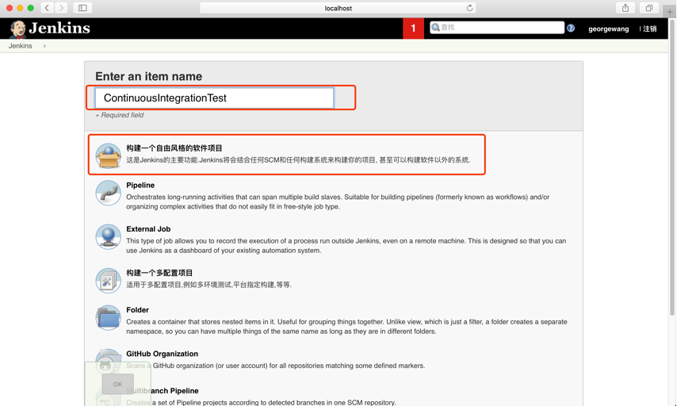
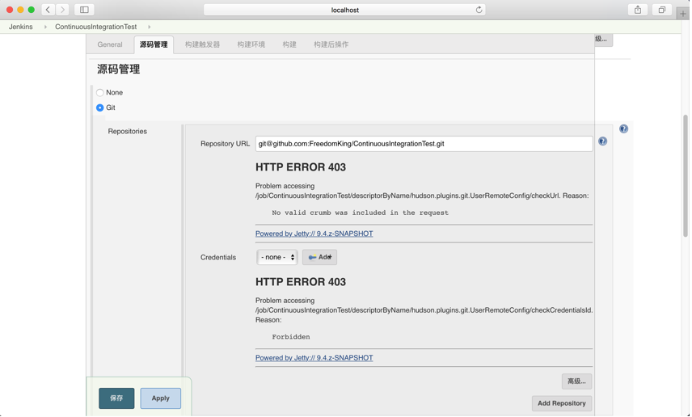
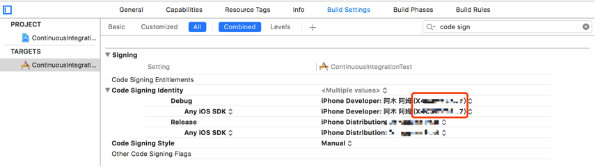

## 前言

相信每个做开发的童鞋都对**持续集成（Continuous Integration）**有所耳闻，持续集成是一种软件开发实践，在多人合作的项目做，通过每天对成员间的代码进行集成，编译，自动化测试，从而能在集成的过程中尽早发现问题，以免到了项目后期才发现大的问题。

显而易见，如果把持续集成工作交由开发人员来完成的话，会非常麻烦和耗时。于是聪明的程序员便编写出一套能够代替我们手动操作的程序，就是**持续集成工具**。

iOS开发比较常用的持续集成工具有：

* Xcode Server
* Jenkins
* Travis CI

其中，Xcode Server为Apple官方推出，官方推出的一般还是比较可靠，我们不用担心什么时候它就没人维护了，不过这篇文章我们不打算介绍，有兴趣的自行前往[官方文档](https://developer.apple.com/library/content/documentation/IDEs/Conceptual/xcode_guide-continuous_integration/)查看。[Travis CI](https://travis-ci.org/)是一个在线持续集成平台，优点是不用自己搭建服务器，而且与Github对接良好，缺点是对私有项目收费。最后就是我们本文要介绍的Jenkins。

Jenkins是一套开源的持续集成工具，需要自己在服务器（iOS项目只能是MacOS）先部署好，然后可以对接项目的Git仓库地址，配置一些定时／事件触发的任务，通过脚本来**编译、测试、打包**。下面我们就进入主题，看看如何在MacOS上部署Jenkins，具体参考[官方文档](https://jenkins.io/doc/book/getting-started/installing/)。

## 环境要求（最低配置）

* Java 8 (JRE 或者 JDK)
* 256MB 空余内存
* 1GB+ 磁盘空间

如果MacOS上没有配置JDK，或者版本不够，那么前往[官网下载](http://www.oracle.com/technetwork/java/javase/downloads/jdk8-downloads-2133151.html)安装。

## 下载并安装Jenkins

在[这里](https://jenkins.io/doc/book/getting-started/installing/)下载最新的安装包：

下载之后打开安装包根据提示安装就可以。

安装完会自动弹出页面，用于解锁jenkins

在终端中来到`/Users/Shared/Jenkins/Home/`目录，执行`$ ll`查看secret文件夹权限为：

		drwx------  11 jenkins  jenkins   374B  9 12 10:04 secrets
		
只有用户jenkins有权限查看，因此我们要修改权限，执行`$ sudo chmod 705 secret`修改为可读；
我们会发现**initialAdminPassword**文件是Jenkins用户可读而已，于是我们继续`sudo chmod 704 initialAdminPassword`，然后`$ vim initialAdminPassword`，进入文件之后复制第一行的密码，填入刚刚的解锁页面，点击**Continuous**按钮继续下一步。（需要注意的是，刚刚修改了secrets目录和initialAdminPassword文件，查看完之后最好还原其权限）
接下来是填入管理员信息：

 

点击保存之后可以看到以下页面：

 

点击开始使用就可以看到Jenkins的控制面板了：

 

(可以看到的是，我们控制面板的地址是`localhost:8080`)

## 配置第一个项目

我们接着点击首页的创建一个新的项目：

 

接着是项目配置信息（该页面后续可以改），包含了6个部分：

 

* **General：**通用配置，项目名称、描述、构建选项
* **源码管理：**配置项目仓库
* **构建触发器：**设置构建出发事件，可选的有脚本、链接、定时、仓库更新等
* **构建环境：**一些环境选项，比如构建之前删除工作空间，如果卡住了推出构建等
* **构建：**核心操作，用shell脚本来构建我们的项目，比如：xcodebuild来编译iOS工程
* **构建后操作：**构建结束之后的选择性工作，比如邮件通知开发人员、接着构建下一个项目、设置github提交状态等

我们第一个项目不用太复杂，需要的配置为**项目信息、配置仓库、仓库更新构建、构建完成邮箱通知开发人员**。

第一，**填写项目信息**

 

第二，**配置仓库**，在此之前请确保你已经有一个项目仓库

 

是如果输入的是ssh地址，那么会出现403的权限错误，如上图所示；因此我们还需要上传配置在GitHub账号的密钥对的私钥，点击下方**Credentials-Add-jenkins**

 

在弹出框填入以下信息，主要是密钥类型Kind和密钥内容。这里的密钥是你自己在GitHub上配置的，位于`~/.ssh`目录中的密钥，如果没有配置，请参考[另一篇文章](http://blog.oneinbest.com/2016/09/22/Github-%E7%9A%84-ssh-%E7%A7%98%E9%92%A5%E9%85%8D%E7%BD%AE%E4%BB%A5%E5%8F%8A%E7%99%BB%E5%BD%95%E9%97%AE%E9%A2%98/)。
信息填好就点击Add回到外面，这里要记住，回到外面记得重新点击下拉按钮选择刚刚添加的密钥。

 

下方还有分支绑定，可以绑定多个分支，这里我们以master分支为例子。

第三，**构建触发器**，这里我们选择**Poll SCM**，然后在下方输入框填入日程描述`H/10 * * * *`，表示每10分钟从仓库拉取一次，如果有新的提交，那么构建项目（读者可以自己测试一下，配置好之后，commit一次，不出意外会有新的构建执行）。关于日程描述的格式，可以点击右边帮助按钮，参考文档介绍。

 

接着，我们先保存配置信息，回到项目控制面板。点击**立刻构建**，看看是否能拉取到仓库代码。

 

拉取成功，左下方会显示相关构建成功信息，这个地方以后也是我们查看构建记录的。

 

项目控制面板左方是一些选项，**修改记录**是仓库的更新记录，**工作空间**是工程文件目录，**Git Polling Log**是拉取日志。

接下来我们点击**配置**继续编写**构建**信息。

**构建**是整个配置的核心内容，对于我们iOS工程来说，主要是利用`xcodebuild`命令来构建项目。这里我们尝试输入一个简单的build脚本来编译工程：

		export DEVELOPER_DIR=/Applications/Xcode.app/Contents/Developer/
		
		xcodebuild clean build
		
 
		
回到工程首页，点击**立刻构建**。

第一次编译很有可能会出现以下错误：

		=== BUILD TARGET ContinuousIntegrationTest OF PROJECT ContinuousIntegrationTest WITH THE DEFAULT CONFIGURATION (Release) ===
		
		Check dependencies
		No profile matching 'xxxxxxxxxx' found:  Xcode couldn't find a profile matching 'xxxxxxxxxx'. Install the profile (by dragging and dropping it onto Xcode's dock item) or select a different one in the General tab of the target editor.
		iOS deployment target '11.0' for architecture 'arm64' and variant 'normal' is greater than the maximum value '10.2.99' for the iOS 10.2 SDK.
		Code signing is required for product type 'Application' in SDK 'iOS 10.2'
		
		** BUILD FAILED **
		
因为jenkins没有办法找到证书及钥匙串，应该按以下步骤解决：

* **复制 /Users/Uesrname/Library/MobileDevice/Provisioning Profiles 整个文件夹到 /Users/Shared/Jenkins/Library/MobileDevice/Provisioning Profiles**
* **复制/Users/wangying/Library/Keychains 中的 login.keychain和login.keychain-db 到 /Users/Shared/Jenkins/Library/Keychains 下面**

继续尝试构建，如果出现以下错误：

		unknown error -1=ffffffffffffffff
		Command /usr/bin/codesign failed with exit code 1
		
那是因为钥匙串需要输入密码，我们使用命令行来解锁钥匙串，在你的**Execute Shell**中加入解锁命令：

		export DEVELOPER_DIR=/Applications/Xcode.app/Contents/Developer/
		
		security unlock-keychain -p password login.keychain
		
		xcodebuild clean build
		
其中`password`是你的系统登录密码。

有时候我们希望新的构建之后，能够通知到项目成员，让其成员了解最新的项目状况，这时候就要用到**构建后操作**。

**邮件通知**需要先配置发件人邮箱信息，回到Jenkins控制面板，点击**系统设置-系统设置**，在**邮件通知**模块，填入以下信息：

 

点击**Test Configuration**可以发送测试邮件，不过在这之前要回到上方的**Jenkins Location**填入系统管理员邮箱，必须和**邮件通知-用户名**保持一致：

 

最后再点击**Test Configuration**，不出意外会通过测试。最后保存。

然后来到项目配置页面，增加构建后操作，选择邮件通知，填入收件人邮箱：

最后是保存配置信息，以后构建失败便会通知收件人。 

至此，最基本的Jenkins项目配置／自动构建已经完成。

## 增强配置

### Xcode插件

Xcode插件可以为我们提供构建设置的界面交互，最基本的构建配置，如：**target名称、配置文件**；也有**代码签名、钥匙串配置**；最后还有一些高级配置，比如：**workspace、scheme指定，以及其它xcodebuild参数选项**。不过，插件只是一个辅助工具，最好还是使用脚本来执行构建任务

我们在控制面板首页，点击**系统管理-插件管理-可选插件**，然后在右上角搜索框输入xcode，如下图，安装**xcode Integration**插件

安装Xcode插件之后，回到**项目配置-构建**模块就可以看到Xcode选项了

**首先，填入Target（一般构建，使用cocoapods／workspace则不同）**

接着是**签名和证书**配置，主要的地方有三个，**Development Team ID、Keychain path、Keychain Password**，如下图：

其中**Keychain path**填写`login.keychain`，在我们之前拷贝的`/Users/Shared/Jenkins/Library/Keychains`目录下自动查找，**Keychain Password**为系统登录密码，与之前`security unlock`一致；

比较容易出错的是**Development Team ID**，这个要和我们在Target中配置的一致，如下图红框内ID所示

不过这样子并不一定是正确的，我们可以在本地终端执行下面构建命令：

		xcodebuild -target ContinuousIntegrationTest -configuration Debug clean build DEVELOPMENT_TEAM=${Development Team ID}
		
如果出现类似一下的错误，那就是**Development Team ID**出错，不一定是上面红框内ID

		Check dependencies
		No certificate matching 'iPhone Developer: xxxxx (xxxxxxxx)' for team 'xxxxxxxx':  Select a different signing certificate for CODE_SIGN_IDENTITY, a team that matches your selected certificate, or switch to automatic provisioning.
		Provisioning profile "xxxxxx" belongs to team "xxxxxxx", which does not match the selected team "xxxxxxxx".
		iOS deployment target '11.0' for architecture 'armv7' and variant 'normal' is greater than the maximum value '10.2.99' for the iOS 10.2 SDK.
		Code signing is required for product type 'Application' in SDK 'iOS 10.2'
		
		** BUILD FAILED **
		
这个时候，我们可以现在Xcode中build一遍，成功之后，在左侧导航栏中点击最新的编译报告，然后在右侧信息中找到Team ID，如红框内的ID所示：

最后再填进配置中，就可以编译成功了。

最后是**Advanced Xcode build options**

主要就是上面表面的三个部分，**Xcode Schema File、Xcode Workspace File、Custom xcodebuild arguments**

前两个是当我们构建cocoapods的项目，或者其它以workspace为基础的项目时，必须指明；最后一个自定义参数，就是对于**xcodebuild**增加插件所不支持的参数，或自己想更灵活地编写。
 
### 添加成员

我们可以为Jenkins增加成员账户，**系统管理-管理用户-新建用户**

## 总结

持续集成是保证软件质量的一种有效的开发模式，jenkins是一款开源、功能丰富的持续集成工具，通过jenkins我们可以设定多样化的持续集成／构建任务，并及时通知项目责任人集成结果，以 及早发现集成问题。本文介绍了iOS工程在Jenkins上的基础配置，经过以上步骤能初步搭建起Jenkins持续集成服务器。Jenkins功能丰富、插件多，一篇文章无法完全讲完，其中诸如**多节点构建**等强大的功能，在后续还会再做介绍。

本文到此完毕，谢谢！